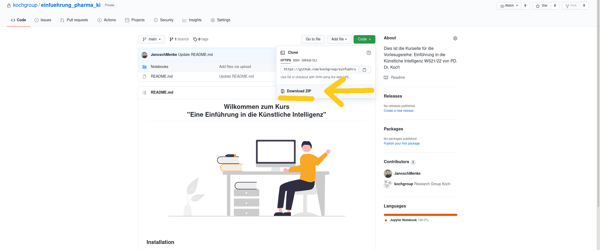

[![CC BY-NC-SA 4.0][cc-by-nc-sa-shield]][cc-by-nc-sa]

<h2 align ="center">Welcome to:   "Introduction to Artificial Intelligence"</h2>

This work is licensed under a
[Creative Commons Attribution-NonCommercial-ShareAlike 4.0 International License][cc-by-nc-sa].

[![CC BY-NC-SA 4.0][cc-by-nc-sa-image]][cc-by-nc-sa]

[cc-by-nc-sa]: http://creativecommons.org/licenses/by-nc-sa/4.0/
[cc-by-nc-sa-image]: https://licensebuttons.net/l/by-nc-sa/4.0/88x31.png
[cc-by-nc-sa-shield]: https://img.shields.io/badge/License-CC%20BY--NC--SA%204.0-lightgrey.svg

## Currently this Repository is being worked on. But feel free to already fork if you feel like it.

## Important TODOs

- find replacement for enamine high fidelity dataset W12

Notebook | English | German
-------- | ------- | ------
**01\. Introduction to Jupyter** |  |    
**02\. Introduction to Python**|  |   
**03\. Cheminformatics & RDKit** | | 
**04\. Linear Regression** |  | 
**05\. Data Science** |  | 
**06\. Linear Algebra** |  | 
**07\. Your first Neural Network** |  | 
**08\. PyTorch** |  | 
**09\. Convolutional Neural Network** |  | 
**10\. Transfer Learning** |  | 
**11\. Recurrent Neural Networks** |  | 
**12\. Autoencoders** |  | 
**13\. Graph Neural Networks** |  | 
**14\. Summary** |  | 

Wir befinden uns auf der GitHub Seite des Kurses "Eine Einführung in die Künstliche Intelligenz". Hier findet ihr alle relevanten Informationen und Dateien die für den Kurs benötigt werden.

**Bevor Sie weiter lesen:**
Laden Sie bitte dieses sogenante *Repository* herunter. Dafür klicken Sie einfach oben rechts auf den grünen Button *Code* und dannach auf *Download ZIP*.  

Entpacken Sie diese Datei an einen Ort den Sie leicht wieder finden können. Alle Daten die hier online zufinden sind, haben Sie jetzt auch auf ihrem privaten Computer.

### Installation
Um den praktischen Teil des Kurses zu folgen brauchen Sie eine Installation von Python also auch Jupyter Notebook. 
Hierfür gibt es drei Möglichkeiten:
1. **Jupyter Hub der WWU**

   Unter diesem [Link](https://jupyterhub.wwu.de/hub/spawn) stellt die WWU Angestellten und Student:innen eine Instanz von Jupyter Notebooks zur Verfügung.
   Hierfür müssen Sie sich lediglich mit ihrem Uni Account anmelden. Hier wird Python auf der Servern der WWU ausgeführt.
   Es benötigt keine Installation, ist aber in den bereit gestellten Resourcen limitiert. D.h. heißt der Code wird eventuell langsamer laufen und es kann eventuell zu Chrashes kommen.
1. **Eigene Installation (Anaconda)** *Empfohlen*

   Ein Installation auf dem privat Computer kann mit Hilfe von [Anaconda](https://www.anaconda.com/) durchgeführt werden.
   Für einen ideale Installation haben wir eine [Anleitung](installation.pdf) bereit gestellt.
1. **Google Collab**
 
   [Google Collab](https://colab.research.google.com/) ist ähnlich wie der WWU Service eine Möglichkeit online Jupyter Notebooks zu benutzen.
   Allerdings läuft der Code dann auf Servern von Google und nicht der WWU. 
   Google Collab stellt mehr Resourcen zu Verfügung als die WWU, allerdings ist ein Google Account nötig.
   **Als Lehrveranstaltung der Uni Münster weisen wir darauf hin, dass das Benutzen eines Google Service keine Notwendigkeit ist.** Wir bieten zwei Alternativen die  Sie nutzen können. Doch letzen Endes liegt es in ihrem Ermessen welchen Service Sie nutzen wollen. 
   
   Auch ist zu beachten, dass bei der Benutzung von Google Collab manche Software Packete immer wieder von neuen Installiert werden müssen.

### Data Sources

Name | Source  
-----| ------ 
MNIST | LeCun, Y., Bottou, L., Bengio, Y., & Haffner, P. (1998). Gradient-based learning applied to document recognition. Proceedings of the IEEE, 86(11), 2278-2324.
BBBP | Martins, I. F., et al. (2012) A Bayesian approach to in silico blood-brain barrier penetration modeling. Journal of Chemical Information and Modeling, 52(6), 1686-1697.
Pneumonia | Kermany, D., Zhang, K., Goldbaum, M. (2018), Large Dataset of Labeled Optical Coherence Tomography (OCT) and Chest X-Ray Images, Mendeley Data, V3, doi: 10.17632/rscbjbr9sj.3   Kermany, D. S., Goldbaum, M., Cai, W., Valentim, C. C., Liang, H., Baxter, S. L., ... & Zhang, K. (2018). Identifying medical diagnoses and treatable diseases by image-based deep learning. Cell, 172(5), 1122-1131.
### Wochenplan 

Woche | Vorlesung | Praktikum
------------ | ------------- | -------------
Woche 1 | Apothkerkammer Vorlesung | Installation - Basic Jupyter Notebook
Woche 2 | Einführung Cheminformatik | Einführung Python
Woche 3 | Lineare Regression | Einführung Cheminformatik
Woche 4 | Data Science - SVM/RF | Einführung Statistik
Woche 5 | Neuronales Netzwerk Teil 1 | Why do we split train and test?
Woche 6 | Neuronales Netzwerk Teil 2| Einfaches Neuronales Netz
Woche 7 | Advanced Neural Network | Neuronales Netz mit Pytorch
Woche 8 | CNN | CNN - MNIST
Woche 9 | CNN Teil 2| CNN - Transfer Learning
Woche 10| Basic RNN | RNN - SMILES
Woche 11| Autoencoders| Autoencoder
Woche 12| Graph Neuronale Netzwerke| Graph Neural Networks
Woche 13| Risse| RISSE
Woche 14| Own Work| Own Work

# Weitere Informationen

[ImageNet Background](https://qz.com/1034972/the-data-that-changed-the-direction-of-ai-research-and-possibly-the-world/)
